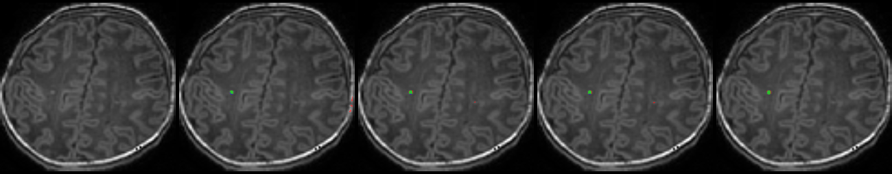
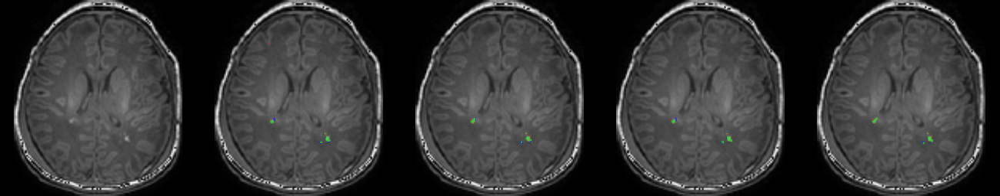

# Trident Segmentation CNN  
---Yalong Liu---  

**Key words:** Deep Learning; Punctate white matter lesions (PWMLs); Brain tumor segmentation.
   

  

**Fig. 1. A Deep Learning method to segment punctate white matter lesions (PWMLs).**
  
**Contributions:**  
1.Trident Segmentation CNN (Convert spatial information into temporal information, which reduces the consumption of computing resources.)   
2.Self-balancing Focal Loss (Balancing the loss of different classes in class imbalance situation and boost the model performance.)  

**This repository includes:**  
1.T1WI of 10 patients for test(Full dataset is not allowed to be made public)  
2.Full code for model training and inference  
## Requirements
Python 3.6.3  
Tensorflow-gpu 1.12.0  
CUDA 9.0  
(tested ok on windows 10)
## Getting Started
1.Download the repositories.  
2.Choose a mode in the main.py('inference' or 'training').  
3.Change parameters in configs/pwml/config_TridentSegNet.py according to the comment  in the file.  
Enjoy!

## Acknowledgment
This repo borrows tons of code from  
[matterport/Mask_RCNN](https://github.com/matterport/Mask_RCNN)  
## Results
**1.Trident Segmentation CNN:**

N&nbsp;|Model|DSC|Sensitive|Specificity|Hausdorff  Distance|Notes
:-:|:-|:-:|:-:|:-:|:-:|:-
A|Mukherjee et al. [4]|0.4288|0.4533|0.9961|59.6432|A Triditional Method
B|Residual U-Net [7]|0.5838|0.6013|**0.9998**|44.7323| Residual U-Net (patch-based)
C|RS-RCNN [2]|0.5986|0.6535|**0.9998**|36.6065|Refined Segmentation R-CNN
D|TS-CNN|0.6024|0.6838|**0.9998**|30.9768|Proposed
E|TS-CNN (Data-aug)|0.6088|0.6838|**0.9998**|30.8133|+ data augmentation
F|TS-CNN (CC=64)|0.6186|0.6952|**0.9998**|28.3413|Double channel counts to 64
G|TS-CNN (SBFL)|**0.6355**|**0.7126**|**0.9998**|**24.5836**|Trained by Self-balancing Focal Loss

 
**2.Self-balancing Focal Loss:**

**Fig. 1. &nbsp;SBFL can balance the class0 loss and class1 loss in the training process to get better performance.**   
  
   
--
**Table 1. Results on MR images**  

N&nbsp;|&nbsp; &nbsp; &nbsp; &nbsp;Original MR&nbsp;&nbsp;&nbsp; &nbsp;  images|Mukherjee et al. [4]|Residual U-Net [7]|&nbsp;  RS-RCNN [2]&nbsp; |Our Method  (TS-CNN)
:--|:--:|:--:|:--:|:--:  

&nbsp;1&nbsp;|
:--|:--:|
&nbsp;2&nbsp;|  
&nbsp;3&nbsp;|  
&nbsp;4&nbsp;|
&nbsp;5&nbsp;|

-----
### Citation

If you use Trident Segmentation CNN in your research, please cite the paper (Uploading now)...

